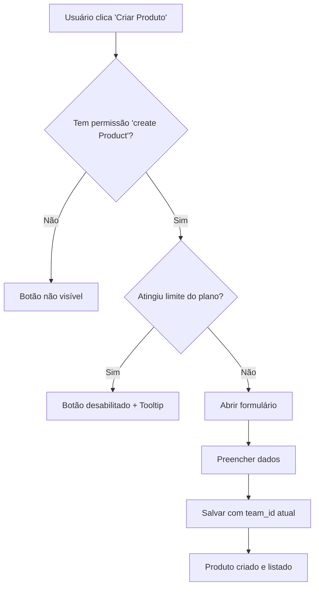

# PRD - Módulo de Produtos (Products Module)

## 1. Visão Geral

### 1.1 Objetivo
Criar o primeiro módulo de negócio do "SaaS Core" que demonstra na prática a integração completa da arquitetura multi-tenant com sistemas de RBAC e Entitlements. O Módulo de Produtos serve como template definitivo para todos os futuros módulos de negócio.

### 1.2 Importância Estratégica
Este módulo é **fundamental** pois estabelece os padrões arquiteturais que serão replicados em todos os módulos futuros, garantindo consistência e qualidade na implementação do isolamento de dados e controle de acesso.

## 2. Integração Arquitetural Completa

### 2.1 Multi-Tenancy (Isolamento por Equipe)
**PRINCÍPIO IMPLEMENTADO:** Todos os produtos pertencem exclusivamente a uma equipe (`team_id`).

```sql
-- Estrutura da tabela products
CREATE TABLE public.products (
    id UUID PRIMARY KEY DEFAULT gen_random_uuid(),
    name VARCHAR(255) NOT NULL,
    description TEXT,
    status VARCHAR(20) NOT NULL CHECK (status IN ('ACTIVE', 'INACTIVE')),
    team_id UUID NOT NULL REFERENCES public.teams(id) ON DELETE CASCADE,
    created_at TIMESTAMP WITH TIME ZONE DEFAULT NOW(),
    updated_at TIMESTAMP WITH TIME ZONE DEFAULT NOW()
);
```

**RLS (Row Level Security):**
```sql
-- Isolamento automático - usuários só veem produtos de suas equipes
CREATE POLICY "Products are isolated by team" ON public.products
    FOR ALL USING (
        team_id IN (
            SELECT team_id FROM public.team_members 
            WHERE user_id = auth.uid()
        )
    );
```

### 2.2 RBAC (Role-Based Access Control)
**PERMISSÕES IMPLEMENTADAS:**
- `create Product`: Criar novos produtos
- `read Product`: Visualizar produtos
- `update Product`: Editar produtos
- `delete Product`: Excluir produtos

**CONTROLE DE VISIBILIDADE:**
```tsx
// Exemplo de uso do componente Can
<Can action="create" subject="Product">
  <Button onClick={handleCreate}>Criar Produto</Button>
</Can>

<Can action="delete" subject="Product">
  <Button onClick={handleDelete}>Excluir</Button>
</Can>
```

### 2.3 Entitlements (Limites do Plano)
**LIMITE IMPLEMENTADO:** `max-products`

**VALORES POR PLANO:**
- **Free:** 5 produtos
- **Pro:** 100 produtos  
- **Enterprise:** Ilimitado (-1)

**CONTROLE DE CRIAÇÃO:**
```tsx
const maxProducts = getLimit('max-products');
const currentCount = products.length;
const isAtLimit = maxProducts > 0 && currentCount >= maxProducts;

<Button disabled={isAtLimit}>
  {isAtLimit ? 'Limite Atingido' : 'Criar Produto'}
</Button>
```

## 3. Estrutura de Componentes

### 3.1 Arquitetura de Componentes
```
/src/components/features/products/
├── ProductsDataTable.tsx    # Tabela principal com todas as integrações
├── ProductForm.tsx          # Formulário reutilizável (criar/editar)
└── (futuras expansões)

/src/pages/admin/
├── Products.tsx             # Página principal (/admin/products)
└── AdminLayout.tsx          # Layout com navegação atualizada
```

### 3.2 ProductsDataTable.tsx (Componente Principal)
**FUNCIONALIDADES INTEGRADAS:**

1. **Multi-tenancy:** Lista apenas produtos da `currentTeamId`
2. **RBAC:** Controla visibilidade de botões baseado em `can(action, subject)`
3. **Entitlements:** Desabilita criação quando limite é atingido
4. **UX:** Tooltip explicativo quando limite é atingido

**CÓDIGO DE EXEMPLO:**
```tsx
// Multi-tenancy: Filtro automático por equipe
const teamProducts = mockDb.getTeamProducts(currentTeamId);

// RBAC: Controle de permissões
const canCreate = can('create', 'Product');
const canUpdate = can('update', 'Product');
const canDelete = can('delete', 'Product');

// Entitlements: Verificação de limites
const maxProducts = getLimit('max-products');
const isAtLimit = maxProducts > 0 && currentCount >= maxProducts;
```

### 3.3 ProductForm.tsx (Formulário Reutilizável)
**CARACTERÍSTICAS:**

- **Validação:** Schema Zod com validações robustas
- **Estados:** Diferenciação entre criação e edição
- **Integration:** Salva com `team_id` automaticamente
- **UX:** Feedback visual e mensagens de erro

## 4. Fluxos de Usuário

### 4.1 Fluxo de Criação


### 4.2 Fluxo de Listagem (Multi-tenancy)
```mermaid
graph TD
    A[Carregar página /admin/products] --> B[Obter currentTeamId]
    B --> C[mockDb.getTeamProducts(teamId)]
    C --> D[Exibir apenas produtos da equipe]
    D --> E{Usuário troca de equipe?}
    E -->|Sim| B
    E -->|Não| F[Mantém lista atual]
```

## 5. Dados Mockados

### 5.1 Produtos de Exemplo
```typescript
export const mockProducts: MockProduct[] = [
  {
    id: '1',
    name: 'Produto Alpha',
    description: 'Nosso produto principal com recursos avançados',
    status: 'ACTIVE',
    teamId: '1', // Pertence à "Minha Primeira Equipe"
    createdAt: '2024-01-01T00:00:00Z',
    updatedAt: '2024-01-01T00:00:00Z',
  },
  // ... mais produtos para diferentes equipes
];
```

### 5.2 Limites Atualizados
```typescript
// Novo limite adicionado
{ id: '5', key: 'max-products', name: 'Máximo de Produtos' }

// Valores por plano
{ planId: '1', limitId: '5', value: 5 },    // Free: 5 produtos
{ planId: '2', limitId: '5', value: 100 },  // Pro: 100 produtos  
{ planId: '3', limitId: '5', value: -1 },   // Enterprise: ilimitado
```

## 6. Operações do Mock Database

### 6.1 Novas Funções Implementadas
```typescript
// Multi-tenant operations
getTeamProducts(teamId: string): MockProduct[]
countTeamProducts(teamId: string): number

// CRUD operations
createProduct(productData): MockProduct
updateProduct(id: string, updates): MockProduct
deleteProduct(id: string): boolean
findProductById(id: string): MockProduct
```

### 6.2 Uso nas Operações
```typescript
// Listagem filtrada por equipe (multi-tenancy)
const products = mockDb.getTeamProducts(currentTeamId);

// Verificação de limite (entitlements)
const count = mockDb.countTeamProducts(currentTeamId);
const limit = getLimit('max-products');
const canCreate = count < limit || limit === -1;
```

## 7. Script SQL e Políticas RLS

### 7.1 Script 19_create_products_table.sql
**RECURSOS IMPLEMENTADOS:**

1. **Estrutura da tabela** com todos os campos necessários
2. **Índices otimizados** para consultas por `team_id`, `status` e `name`
3. **RLS habilitado** para isolamento automático
4. **Políticas granulares** para SELECT, INSERT, UPDATE e DELETE

### 7.2 Isolamento Garantido
```sql
-- Política que garante isolamento total
CREATE POLICY "Products are isolated by team" ON public.products
    FOR ALL USING (
        team_id IN (
            SELECT team_id FROM public.team_members 
            WHERE user_id = auth.uid()
        )
    );
```

## 8. Template para Futuros Módulos

### 8.1 Padrão Estabelecido
Este módulo estabelece o padrão que **DEVE** ser seguido em todos os futuros módulos:

1. **Tabela com `team_id`** obrigatório
2. **RLS com políticas** de isolamento por equipe
3. **Permissões RBAC** específicas para o módulo
4. **Limites de Entitlements** configuráveis por plano
5. **Componentes integrados** com as três camadas

### 8.2 Checklist para Novos Módulos
- [ ] Tabela com campo `team_id NOT NULL`
- [ ] Scripts SQL com RLS habilitado
- [ ] Permissões no mockPermissions
- [ ] Limites no mockLimits (se aplicável)
- [ ] Componente DataTable com filtro por equipe
- [ ] Formulário com validação e team_id automático
- [ ] Página protegida com `<Can>` component
- [ ] Operações no mockDb filtradas por equipe

## 9. Benefícios Demonstrados

### 9.1 Isolamento Total de Dados
- Usuários de diferentes equipes **nunca** veem produtos uns dos outros
- Mudança de equipe atualiza automaticamente a lista
- RLS garante isolamento mesmo em falhas de aplicação

### 9.2 Controle Granular de Acesso  
- Botões aparecem/desaparecem baseado em permissões
- Diferentes roles têm diferentes níveis de acesso
- Flexibilidade total para configurar permissões

### 9.3 Limites Dinâmicos por Plano
- Upgrade de plano aumenta limites automaticamente
- Feedback visual claro sobre limites
- Bloqueio automático quando limite é atingido

## 10. Próximos Passos

### 10.1 Validação
- [ ] Teste completo dos fluxos de CRUD
- [ ] Validação do isolamento entre equipes  
- [ ] Teste dos limites por plano
- [ ] Verificação das permissões por role

### 10.2 Expansões Futuras
- Sistema de categorias de produtos
- Upload de imagens para produtos
- Histórico de alterações
- Exportação de dados (feature Premium)

## 11. Conclusão

O Módulo de Produtos estabelece com sucesso a **implementação de referência** para a arquitetura multi-tenant do SaaS Core. Ele demonstra na prática como integrar seamlessly:

- **Multi-tenancy** com isolamento automático de dados
- **RBAC** com controle granular de permissões  
- **Entitlements** com limites dinâmicos por plano

Este módulo serve como **template obrigatório** para todos os futuros desenvolvimentos, garantindo consistência arquitetural e qualidade de implementação em todo o sistema.

**Impacto:** Primeira implementação prática da arquitetura multi-tenant, validando todos os conceitos teóricos e estabelecendo padrões para desenvolvimento futuro.