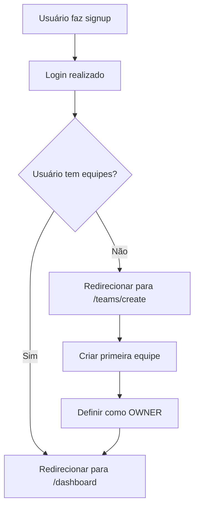
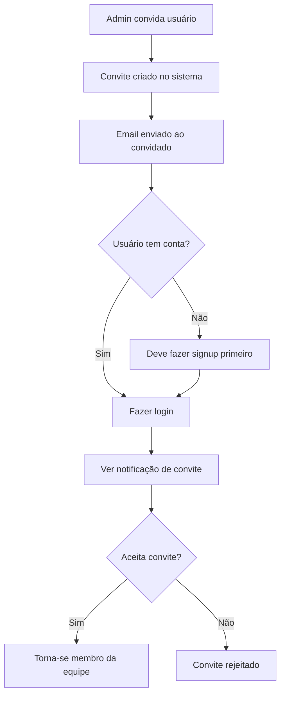

# PRD - Módulo de Equipes (Teams Module)

## 1. Visão Geral

### 1.1 Objetivo
Transformar o "SaaS Core" de um sistema single-tenant para multi-tenant através da implementação de um módulo de equipes completo. Este módulo permite que usuários criem espaços de trabalho isolados, convidem colaboradores e gerenciem permissões dentro do contexto de cada equipe.

### 1.2 Impacto Arquitetônico
Esta é uma **mudança fundamental** na arquitetura do sistema, introduzindo o conceito de isolamento de dados por equipe (tenant isolation) que será a base para todas as funcionalidades futuras.

## 2. Arquitetura Multi-Tenant

### 2.1 Princípio de Isolamento de Dados
**REGRA FUNDAMENTAL:** A partir desta implementação, `team_id` se torna a chave primária de contexto para todos os dados da aplicação.

```sql
-- Padrão obrigatório para todas as tabelas futuras
CREATE TABLE public.exemplo_tabela (
  id UUID PRIMARY KEY DEFAULT gen_random_uuid(),
  team_id UUID NOT NULL REFERENCES public.teams(id) ON DELETE CASCADE,
  -- outros campos...
);

-- RLS obrigatório para isolamento
CREATE POLICY "tenant_isolation" ON public.exemplo_tabela
  FOR ALL USING (
    team_id IN (
      SELECT team_id FROM public.team_members 
      WHERE user_id = auth.uid()
    )
  );
```

### 2.2 Estrutura de Dados

#### Teams (Equipes)
```typescript
interface Team {
  id: string;
  name: string;
  ownerId: string;
  createdAt: string;
  updatedAt: string;
}
```

#### Team Members (Membros da Equipe)
```typescript
interface TeamMember {
  teamId: string;
  userId: string;
  role: 'OWNER' | 'ADMIN' | 'MEMBER';
  joinedAt: string;
}
```

#### Team Invitations (Convites)
```typescript
interface TeamInvitation {
  id: string;
  teamId: string;
  email: string;
  role: 'ADMIN' | 'MEMBER';
  status: 'PENDING' | 'ACCEPTED' | 'DECLINED';
  invitedBy: string;
  createdAt: string;
  expiresAt: string;
}
```

## 3. Sistema de Permissões (RBAC) por Equipe

### 3.1 Hierarquia de Roles
- **OWNER** (Proprietário): Controle total da equipe
- **ADMIN** (Administrador): Pode gerenciar membros e configurações
- **MEMBER** (Membro): Acesso básico aos recursos da equipe

### 3.2 Matriz de Permissões
| Ação | OWNER | ADMIN | MEMBER |
|------|-------|-------|--------|
| Convidar membros | ✅ | ✅ | ❌ |
| Alterar roles | ✅ | ✅* | ❌ |
| Remover membros | ✅ | ❌ | ❌ |
| Excluir equipe | ✅ | ❌ | ❌ |
| Acessar dados | ✅ | ✅ | ✅ |

*ADMINs não podem alterar roles de OWNERs

## 4. Fluxos de Usuário

### 4.1 Fluxo Pós-Cadastro (OBRIGATÓRIO)


### 4.2 Fluxo de Convites


## 5. Componentes e Estrutura

### 5.1 Componentes Principais

#### TeamSwitcher
```typescript
/**
 * Seletor de equipes na navegação principal
 * Gerencia o estado global da equipe atual
 */
<TeamSwitcher 
  compact={false} 
  className="w-[200px]"
/>
```

#### MembersDataTable
```typescript
/**
 * Tabela de gerenciamento de membros
 * Permite alterar roles e remover membros
 */
<MembersDataTable />
```

#### InvitationsForm
```typescript
/**
 * Formulário para convidar novos membros
 * Lista convites pendentes
 */
<InvitationsForm />
```

### 5.2 Context e Estado Global

#### TeamContext
```typescript
/**
 * Context principal para gerenciamento de equipes
 * Mantém estado da equipe atual e operações
 */
interface TeamContextValue {
  currentTeam: Team | null;
  currentTeamId: string | null;
  userTeams: Team[];
  switchTeam: (teamId: string) => void;
  createTeam: (name: string) => Promise<void>;
  // ... outras operações
}
```

## 6. Rotas e Navegação

### 6.1 Novas Rotas
```
/teams/create              # Criação obrigatória de equipe
/settings/team/members     # Gerenciamento de membros  
/settings/team/invitations # Gerenciamento de convites
```

### 6.2 Integração com Header
O `AppHeader` foi atualizado para incluir o `TeamSwitcher`, permitindo navegação fluida entre equipes em todas as páginas da aplicação.

## 7. Scripts SQL e Migração

### 7.1 Scripts Implementados
- `15_create_teams_table.sql`: Tabela principal de equipes
- `16_create_team_members_table.sql`: Relacionamento usuário-equipe-role
- `17_create_invitations_table.sql`: Sistema de convites
- `18_add_team_id_to_projects.sql`: Exemplo de isolamento para tabelas futuras

### 7.2 Políticas RLS
Todas as tabelas implementam Row Level Security (RLS) para garantir isolamento de dados entre equipes.

## 8. Considerações de Implementação

### 8.1 Performance
- Índices otimizados para consultas por `team_id`
- Consultas sempre filtradas pelo contexto da equipe atual
- Cache do estado da equipe no Context

### 8.2 Segurança
- RLS obrigatório em todas as tabelas
- Validação de permissões no frontend e backend
- Expiração automática de convites (7 dias)

### 8.3 UX/UI
- Transições suaves entre equipes
- Indicadores visuais do contexto atual
- Feedback claro sobre permissões

## 9. Próximos Passos

### 9.1 Validação
- [ ] Teste completo dos fluxos de usuário
- [ ] Validação das políticas RLS
- [ ] Teste de performance com múltiplas equipes

### 9.2 Futuras Implementações
- Sistema de notificações para convites
- Auditoria de ações por equipe
- Limites de membros por plano
- Configurações avançadas de equipe

## 10. Conclusão

O Módulo de Equipes estabelece a fundação arquitetônica para um SaaS verdadeiramente multi-tenant. A implementação garante isolamento completo de dados, sistema robusto de permissões e experiência de usuário fluida para colaboração em equipe.

**Impacto:** Esta implementação transforma fundamentalmente a arquitetura do sistema, preparando-o para escalar como uma plataforma colaborativa empresarial.